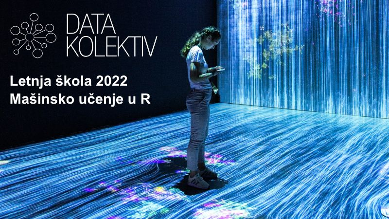

## DATA SCIENCE SUMMER SCHOOL 2022 :: MACHINE LEARNING IN R
This is a DataKolektiv repository for our MACHINE LEARNING IN R Data Science Summer School 2022. 
**contact:** [hello@datakolektiv.com](mailto:hello@datakolektiv.com)

The Summer School will be hosted in [Startit Center Belgrade](https://startit.rs/beograd/) every Saturday in June 2022, 09:00 - 18:00 CET. Asynchronous consultations and work will be carried on via Slack and GitHub 4. - 30. June 2022.

---

### PROGRAM

**WEEK 1.**

- Saturday, 4. June, 09:00 - 18:00 CET, Startit center, Belgrade
   - 09:00 - 12:30. [Introduction to R programming](https://www.youtube.com/playlist?list=PLjgj6kdf_snYBkIsWQYcYtUZiDpam7ygg): [data types](https://youtu.be/SkZE15wANCM), [vectors, matrices, and vectorization](https://youtu.be/2TcPAZOyV0U), [lists](https://youtu.be/SsOs8Dddk-A), the [data.frame class](https://youtu.be/qisuPBbJe3U), [I/O operations](https://youtu.be/oRaPjJefoTo), [control flow](https://youtu.be/h2zPmHhzmzo), [functions](https://youtu.be/p8tAQx7ijXE), [functional programming](https://youtu.be/34sbvhr_pm8).
   - 14:30 - 18:00. [tidyverse](https://www.tidyverse.org/) approach to R programming: [dplyr](https://dplyr.tidyverse.org/) and [tidyr](https://tidyr.tidyverse.org/) for data management and processing. 
- Asynchronous (Slack, GitHub), Monday, 6. June - Friday, 10. June
   - Data Visualization in [ggplot2](https://ggplot2.tidyverse.org/)
   - Data Cleaning and Transformation (i.e. Data Wrangling) in [stringr](https://stringr.tidyverse.org/), [dplyr](https://dplyr.tidyverse.org/) and [tidyr](https://tidyr.tidyverse.org/); [Exploratory Data Analysis (EDA)](http://datakolektiv.com/app_direct/introdsnontech/IntroDataScience_NonTech_S06.nb.html) in R.
- Learning Material: 
   - [R for Data Science](https://r4ds.had.co.nz/)
   - [DataKolektiv's DATA SCIENCE SESSIONS: Session 01-08](http://datakolektiv.com/app_direct/introdsnontech/)
- Review Material (Math):
   - [Khan Academy: Probability](https://www.khanacademy.org/math/statistics-probability/probability-library)
   - [Khan Academy: Random Variables](https://www.khanacademy.org/math/statistics-probability/random-variables-stats-library)
   - [Khan Academy: Modelling Data Distributions](https://www.khanacademy.org/math/statistics-probability/modeling-distributions-of-data)
   - [Khan Academy: Summarizing Quantitative Data](https://www.khanacademy.org/math/statistics-probability/summarizing-quantitative-data)

---

**WEEK 2.**

- Saturday 11. June, 09:00 - 18:00 CET, Startit center, Belgrade
   - 09:00 - 12:30. Linear and Multiple Linear Regression [[review]](https://youtu.be/q1RD5ECsSB0)
   - 14:30 - 18:00. Binomial Logistic and Multinomial Logistic Regression for Classification Problems [[review1]](https://www.youtube.com/watch?v=DMAdIdUHpZY), [[review2]](https://youtu.be/PpDB66hzjGw)
- Asynchronous (Slack, GitHub), Monday, 13. June - Friday, 17. June
   - Case Study 1: Churn Prediction
   - Control for Overfit 1: Regularized Linear and Generalized Linear Models [[review1]](https://www.youtube.com/watch?v=Q81RR3yKn30), [[review2]](https://www.youtube.com/watch?v=NGf0voTMlcs), [[review3]](https://www.youtube.com/watch?v=1dKRdX9bfIo)

--- 

**WEEK 3.**

- Saturday, 18. June, 09:00 - 18:00 CET, Startit center, Belgrade
   - 09:00 - 12:30. Cross-Validation and Regularization in Classification Problems [[review]](https://www.youtube.com/watch?v=fSytzGwwBVw); Model Selection (ROC analysis) [[review]](https://towardsdatascience.com/roc-curve-a-complete-introduction-2f2da2e0434c); **note**: Python code, we will have ours in R
   - 14:30 - 18:00. Decision Trees (CART) [[review]](https://www.youtube.com/watch?v=uXIIk7suD6c)
- Asynchronous (Slack, GitHub), Monday, 20. June - Friday, 24. June
   - Case Study 2: Price Prediction in the Real Estate Market
   - Control for Overfit 2: Cross-Validation and Regularization in Regression Models

---

**WEEK 4.**

- Saturday, 25. June, 09:00 - 18:00 CET, Startit center, Belgrade
   - 09:00 - 12:30. Random Forests for Regression and Classification Problems [[review1]](https://www.youtube.com/watch?v=gmmV4drPTS4), [[review2]](https://www.youtube.com/watch?v=RrJtu5RLZQs)
   - 14:30 - 18:00. Gradient Boosting: XGBoost Model for Regression and Classification Problems [[review1]](https://xgboost.readthedocs.io/en/stable/tutorials/model.html); **note** a bit heavy on math perhaps; [[review2]](https://www.youtube.com/watch?v=R_uF2ZgmRiw)
- Asynchronous (Slack, GitHub), Monday, 27. June - Thursday, 30. June
   - Case Study 3: Web Content Popularity Prediction.
   - Case Study 4: Complete Model Layout and Find-Tuning XGBoost for Regression and Classification Problems 
